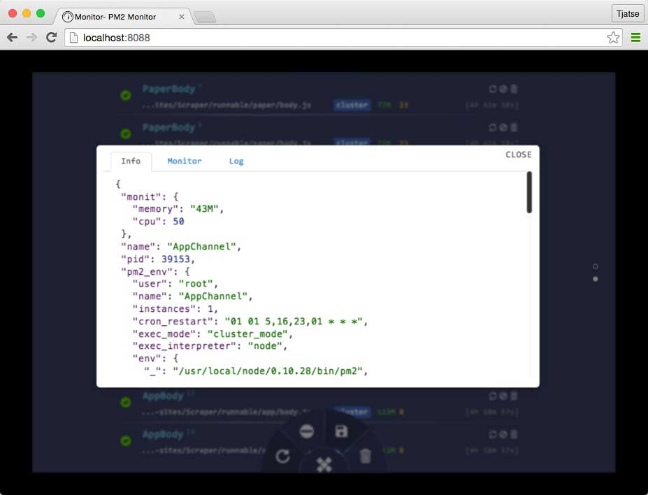
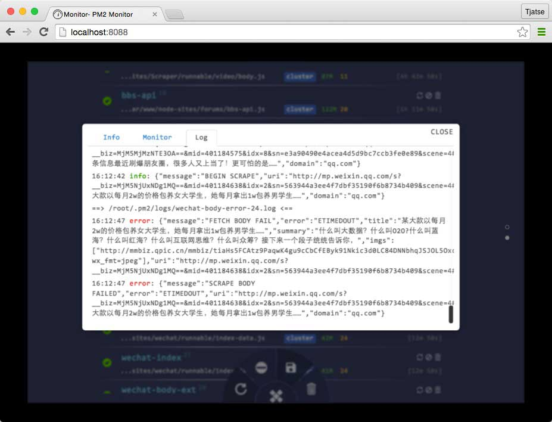

pm2-gui [](http://badge.fury.io/js/pm2-gui) [](https://travis-ci.org/Tjatse/pm2-gui)
=======

An elegant web interface for Unitech/PM2.

> Compatible with PM2 v0.12.7+
> If you wanna update to pm2-gui@latest, make sure you've read the [change logs](CHANGELOG.md).

# Guide
- [Features](#feats)
- [Cautions](#cauts)
- [Installation](#ins)
- [CLI](#cli)
  - [Run Web Interface](#cli_web)
  - [Configs](#cli_confs)
- [Authorization](#auth)
- [UI/UX](#ui)
- [Serving apps locally with nginx and custom domain](#serv)

<a name="feats" />
# Features
- Curses-like dashboard
- All the heartbeats (no matter **monitor** or **tail (logs)**) are automatic destroyed.
- The `PM2` processes are watched by a subscribed emitter.
- Communicated with `PM2` through **RPC** socket directly.
- Socket.io between client and server.
- Monitor CPU and Memory usage of server in a real-time.
- Monitor `PM2` processes in a real-time.
- PM2 *restart/stop/delete*.
 - *stopWatch* files before *restart/stop/delete*
 - *restartWatch* files before *restart*
- Supports [ANSI color codes](#ss_logs) by [ansi-html](https://github.com/Tjatse/ansi-html).
- High performance. In my case, there are near one hundred processes, but `pm2-gui` works fine.

<a name="cauts" />
# Cautions
- Web Interface is wrote by CSS3 && HTML5, so view it with the latest version of the browser (WebGL, Animation, WebSocket supports), e.g. Chrome, Safari and Firefox.
- I've never test it on Internet Explorer / Windows.

<a name="ins" />
# Installation
```
$ npm install -g pm2-gui
```

<a name="cli" />
# CLI
```
  Usage: pm2-gui [cmd] [options]

  Commands:

    start [options] [port]  Launch the web server, port default by 8088
    config                  show all configs
    set <key> <value>       set config by key-value pairs
    rm <key>                remove config by key

  Options:

    -h, --help     output usage information
    -v, --version  output the version number

  Basic Examples:

    Start the web server, by default port (8088):
    $ pm2-gui start

    Start the web server, by specific port (8090):
    $ pm2-gui start 8090

    Start the web server, by specific configuration file (pm2-gui.ini):
    $ pm2-gui start --config

    Start the web server, by specific configuration file:
    $ pm2-gui start --config my-config.ini

```

<a name="cli_web" />
## Run Web Interface
```bash
  Usage: start [options] [port]

  Options:

    -h, --help       output usage information
    --config [file]  pass ".ini" configuration file (with options)
    --no-debug       hide stdout / stderr information
```

**Daemonic:**
```bash
# start
$ nohup pm2-gui start > /dev/null 2>&1 & echo $! > /path/to/pm2-gui.pid
# stop
$ kill -9 `cat /path/to/pm2-gui.pid`
```

<a name="cli_confs" />
## Configs
```ini
pm2 = ~/.pm2
refresh = 5000
debug = false
port = 8088
```

- **refresh** The heartbeat duration of monitor (backend), `5000` by default.
- **pm2** Root directory of Unitech/PM2, `~/.pm2` by default.
- **port** Port of web interface.
- **debug** A value indicates whether show the debug information, `true` by default.
- **password** The encrypted authentication code, if this config is set, users need to be authorized before accessing the index page, `password` could only be set by `pm2-gui set password [password]` ([authorization](#authorization)).

### File
You can quick set configurations by `pm2-gui start --config [file]`, the `[file]` must be a valid **ini** file, and can include all the above keys.

Example
```bash
# Load the configuration file which is named as `pm2-gui.ini` in current directory.
$ pm2-gui start --config

# Load the specific configuration file under current directory, `.ini` postfix is optional.
$ pm2-gui start --config conf
$ pm2-gui start --config conf.ini
```

### Set
Usage
```bash
$ pm2-gui set <key> <value>
```

Example
```bash
$ pm2-gui set refresh 2000
```

Above command will set `refresh` to 2 seconds.

### Remove
Usage
```bash
$ pm2-gui rm <key>
```

Example
```bash
$ pm2-gui rm refresh
```

Above command will remove `refresh` config and it will be set to `5000` (milliseconds) by default.

### Update via `vi`
```bash
$ vi $PM2_ROOT/.pm2/pm2-gui.ini
```

### Cleanup
```bash
$ rm $PM2_ROOT/.pm2/pm2-gui.ini
```

> The value of `$PM2_ROOT` is `~/` by default.

<a name="auth" />
# Authorization
Run the following commands:
```bash
$ pm2-gui set password 1234
$ pm2-gui start
```

When you visiting `http://[domain]:8088` in your browser, it will be redirected to `http://[domain]:8088/auth`, and you need to typo the password (`1234`) to login.

Otherwise, if you do not want to deny anybody, just simply remove it:
```bash
$ pm2-gui rm password
$ pm2-gui start
```

<a name="ui" />
# UI/UX
- Amazing and smooth animations.
- High performance.

Some screenshots:
Curses-like dashboard:


Backend (without `--no-debug` option):


Auth


<a name="ss_home" />
Home


Processes


Describe Complete Information



CPU && Memory Usage


<a name="ss_logs" />
Tail Logs



<a name="serv" />
# Serving apps locally with nginx and custom domain

```ini
map $http_upgrade $connection_upgrade {
    default upgrade;
    '' close;
}

upstream pm2-gui {
    server 127.0.0.1:8000;
}

server {
    listen 80;
    server_name pm2-gui.dev;

    #useless but can not get rid of.
    root /path/to/pm2-gui/web/public;

    try_files $uri/index.html $uri.html $uri @app;

    # paths
    location @app {
      proxy_set_header X-Forwarded-For $proxy_add_x_forwarded_for;
      proxy_set_header Host $http_host;
      proxy_redirect off;

      proxy_pass http://pm2-gui;
    }

    # socket.io
    location /socket.io {
        proxy_pass http://pm2-gui;
        proxy_http_version 1.1;
        proxy_set_header Upgrade $http_upgrade;
        proxy_set_header Connection $connection_upgrade;
    }
}
```

## Test
```bash
$ npm test
```

## License
Licensed under the Apache License, Version 2.0 (the "License");
you may not use this file except in compliance with the License.
You may obtain a copy of the License at

    http://www.apache.org/licenses/LICENSE-2.0

Unless required by applicable law or agreed to in writing, software
distributed under the License is distributed on an "AS IS" BASIS,
WITHOUT WARRANTIES OR CONDITIONS OF ANY KIND, either express or implied.
See the License for the specific language governing permissions and
limitations under the License.

